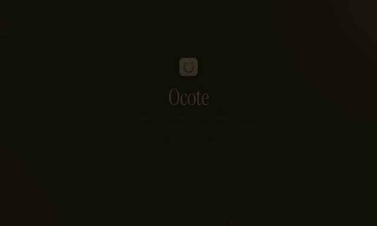

<div align="center">


# Ocote

### The terminal that lights up the black screen
**Offline · No AI · Built for humans**

[**English**](README.md) · [Español](README.es.md)

[](LICENSE)
[]()
[]()
[]()
[](https://github.com/Teshre/Ocote/stargazers)

<!-- TODO release: record a short GIF (prompt + autocomplete + tooltip + theme switch) and place it at docs/assets/demo.gif -->
<!--  -->

</div>

---

## What is Ocote?

**Ocote** is a command-line terminal designed to be the most **accessible** on the market — from absolute beginners to seasoned developers. It takes its name from *ocote*, the resinous pinewood used across Mesoamerica to start a fire: the spark that lights up what used to be an intimidating black screen.

Unlike modern terminals betting on cloud AI assistants, Ocote is **radically offline**: all the help — command descriptions, autocomplete, suggestions — lives in a local database. What runs on your machine stays on your machine.

**Positioning:** anti-AI, deterministic, offline-first.
**Primary market:** Latin America first — Spanish as the primary language.

---

## ✨ Features

### 🎓 Learn as you type
- **Command Knowledge Base (CKB):** 153 commands documented in **5 languages** (Spanish, English, Portuguese, French, German), stored in a local SQLite database.
- **Educational tooltip:** when you run a recognized command, a non-intrusive card shows its description, common flags, and an example.
- **Contextual autocomplete:** type the start of a command and suggestions appear with their description. In a Rust project you'll see `cargo build` first; in a Node one, `npm run dev`.

### 📁 Built-in file explorer
- Side panel showing your current directory with per-type file icons.
- **Two-way sync:** navigate with clicks in the explorer or with `cd` in the terminal — both stay in sync.
- Navigable breadcrumb with clickable segments.

### 🎨 A prompt with its own identity
5 prompt presets designed as a visual layer over the terminal (without breaking ANSI output):

| Preset | Style |
|--------|-------|
| `pill` | Rounded capsules — Ocote's signature |
| `block` | Each command is a card, Warp-style |
| `rail` | Vertical rail anchoring the prompt |
| `ribbon` | Subtle underline, tab-indicator style |
| `minimal` | Typography only, clean and quiet |
| `passthrough` | Respects your native prompt (p10k, oh-my-zsh…) |

- **10 color themes:** Ocote Dark/Light, Dracula, One Dark, Monokai, Solarized Dark/Light, Gruvbox, Nord, Tokyo Night.
- **Nerd Fonts** bundled: JetBrainsMono NF, FiraCode NF, MesloLGS NF.

### 🐚 Ready out of the box — 4 shells, zero config
Ocote ships with the tools you'd normally install and configure by hand:

| | zsh | bash | fish | PowerShell |
|---|:---:|:---:|:---:|:---:|
| Prompt + presets | ✅ | ✅ | ✅ | ✅ |
| **fzf** (Ctrl+R history, Alt+C fuzzy cd) | ✅ | ✅ | ✅ | ✅ |
| **zoxide** (`z` — smart cd) | ✅ | ✅ | ✅ | ✅ |
| **bat** (cat with colors) | ✅ | ✅ | ✅ | ✅ |
| Syntax highlighting | ✅ | — | ✅ | ✅ |
| Autosuggestions | ✅ | — | ✅ | ✅ |

*Everything bundled: the user installs and configures nothing.*

### 🧩 Other touches
- **Multiple terminal tabs** (`Ctrl+T` new, `Ctrl+W` close).
- **Localized UI** in 5 languages.
- **Selectable app icon** (light/dark).
- **Settings** for font size, cursor style, and scrollback.
- **Onboarding** welcome on first run.

---

## 🚀 What sets Ocote apart

1. **No runtime AI** — 100% offline, zero network requests.
2. **Command Knowledge Base** in local SQLite — answers in microseconds.
3. **Built-in file explorer** with live sync.
4. **Visual autocomplete** with command descriptions.
5. **Non-intrusive educational tooltip** (`Esc` to dismiss).
6. **Contextual suggestions** via pure heuristics — no ML.
7. **Visual prompt system** with HTML presets over the canvas.

---

## 📦 Installation

> ⚠️ Ocote is under active development (Phase 4 / pre-release). Signed binaries are coming soon.

### From binaries (coming soon)
Download the latest version for your platform from [Releases](https://github.com/Teshre/Ocote/releases):
- **macOS:** `.dmg` (Apple Silicon / Intel)
- **Windows:** `.exe` (NSIS installer)
- **Linux:** `.AppImage` / `.deb`

### From source
Requirements: [Rust](https://rustup.rs), [Node.js](https://nodejs.org), and [pnpm](https://pnpm.io).

```bash
git clone https://github.com/Teshre/Ocote.git
cd Ocote
pnpm install

# Development (hot-reload)
pnpm tauri dev

# Production build
pnpm tauri build
```

---

## 🛠️ Tech stack

| Layer | Technology |
|-------|-----------|
| Backend | **Rust** (`portable-pty`, `rusqlite`, `serde`) |
| UI framework | **Tauri v1** (native OS webview) |
| Frontend | Vanilla HTML/CSS/JS (no frameworks) |
| Terminal rendering | **xterm.js** (canvas/WebGL) |
| Database | Local SQLite |
| Platforms | macOS · Windows · Linux |

**Why Tauri and not Electron?** The binary weighs ~33 MB (vs ~150 MB for Electron) because it uses the system's native webview. For a terminal that sells itself as lightweight and offline, size matters.

---

## 🗺️ Project status

Ocote is in **Phase 4** of its roadmap (release prep). Already working:

- ✅ Real PTY with zsh/bash/fish/PowerShell connected
- ✅ Rendering with xterm.js + custom overlay system
- ✅ File explorer with sync
- ✅ Multilingual CKB (153 commands × 5 languages)
- ✅ Autocomplete and educational tooltip
- ✅ 10 themes + 5 prompt presets
- ✅ Out-of-the-box tools (fzf, zoxide, bat, syntax highlighting, autosuggestions)
- ✅ Cross-platform distribution via GitHub Actions

**Next steps:** code signing (macOS Developer ID), auto-updater, website, and community.

See the [CHANGELOG](CHANGELOG.md) for detailed history and the [devlog](docs/devlog.md) for design decisions.

---

## 🤝 Contributing

Ocote is an open project. Whether you want to add commands to the CKB, translations, themes, or code — contributions are welcome! Open an [issue](https://github.com/Teshre/Ocote/issues) to discuss large changes before a PR.

---

## ⭐ Star history

<a href="https://star-history.com/#Teshre/Ocote&Date">
  
</a>

---

## 📄 License

[MIT](LICENSE) © 2026 Eduardo Perry Rangel

<div align="center">

---

*Made with 🔥 in Latin America.*

</div>
